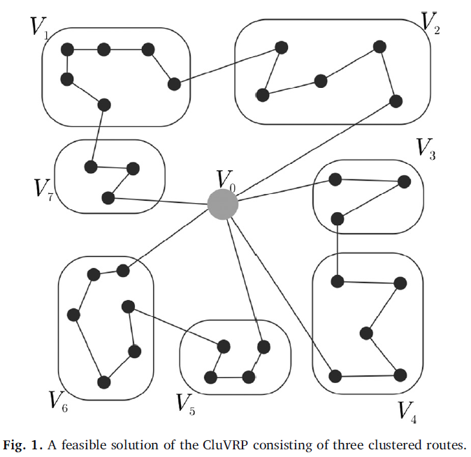
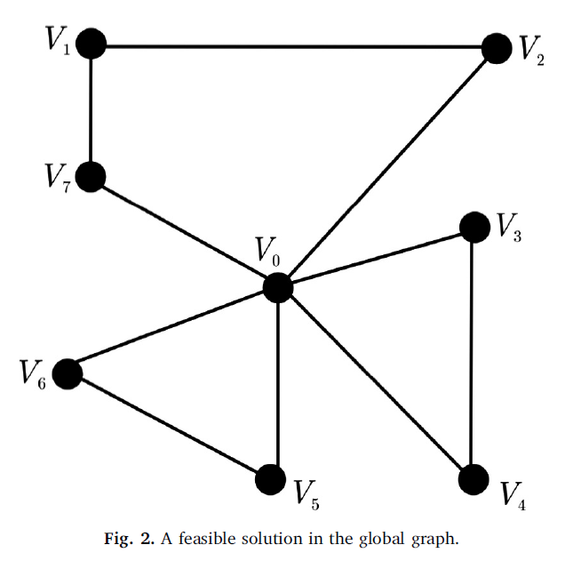

# Advanced_Algorithms
- CCVRP optimization with GA, ACS(ACO).
- Functional Value optimization with PSO

  
  

## Problem Description
### CCVRP :
We are given n − 1 nodes, one depot and distances from the nodes to the depot, as well as between nodes.
In addition to the Classical CVRP, a cluster should be visited by only one truck and this visit cannot be split (once a truck starts
to visit a cluster, it should complete the visit of all nodes in that cluster). The problem is
to find tours for the trucks of minimal total length that satisfy the node demand without
violating the truck capacity constraint and the clustering constraints.

