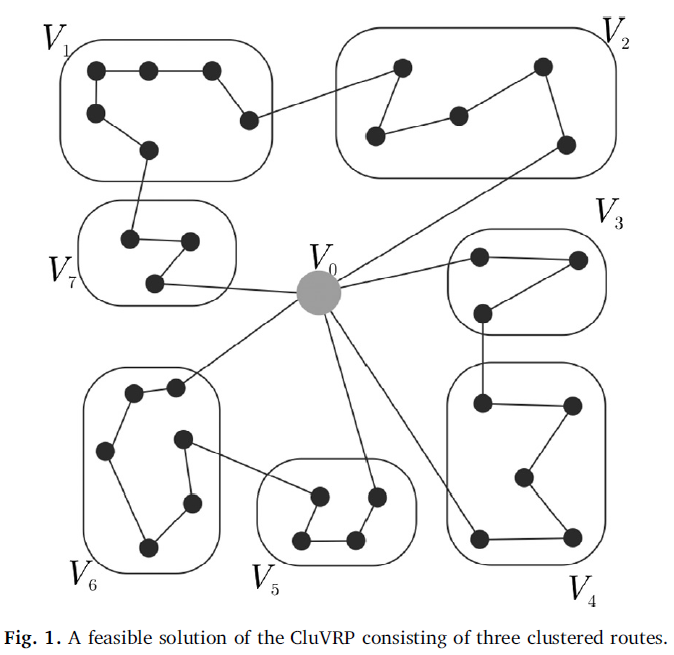

# Advanced_Algorithms
- CCVRP optimization with GA, ACS(ACO).
- Functional Value optimization with PSO


## Problem Description
We are given n − 1 nodes, one depot and distances from the nodes to the depot, as well as between nodes.
In addition to the Classical CVRP, a cluster should be visited by only one truck and this visit cannot be split (once a truck starts
to visit a cluster, it should complete the visit of all nodes in that cluster). The problem is
to find tours for the trucks of minimal total length that satisfy the node demand without
violating the truck capacity constraint and the clustering constraints.

<div align="center">
  
  
</div>


## Instance Description
**TSPLIB** is a library of sample instanes for the TSP (and related problems) from various soures and of various types.
Instanes of the following problem classes are available:
+ Symmetric traveling salesman problem **(TSP)**
+ Hamiltonian cycle problem **(HCP)**
+ Asymmetric traveling salesman problem **(ATSP)**
+ Sequential ordering problem **(SOP)**
+ Capaitated vehicle routing problem **(CVRP)**
- ### The file format
  Each file consists of **specification part** and of a **data part**. The specification part contains information on the file format and on its contents. The data part contains explicit data. 
python implementation

## Algorithms

All the algorithms are designed base on the **Lexicographic Search** using **forwarding and back warding path-preserving-3-exchange** as explained in [An Ant Colony System Hybridized with a New Local Search for the Sequential Ordering Problem paper](http://people.idsia.ch/~luca/fd18cc00a0_article.pdf).

<div align="center">
  
</div>

## Running
Just go to related algorithm directory and run the python code. example:
```
 cd ./SA
 python main.py
```

## Results
All results and comparing analyze are presented in **Report.pdf** files.
overal algorithms comparisons result is as follow:

+ ### SA 

    | Instance | BKS | best | average | worst | avg_time |
    | :---     |:---:| ---: | ---:    | ---:  | ---:     |
    | ESC78.sop | 18230 | 18250 | 18400.5 | 18400.5 | 1.7924 |
    | susan.260.158.sop | 1016 | 1123 | 1128.8| 1136 | 8.6370|
    | R.200.100.1.sop | 61 | 340 | 402.3| 453 | 28.773 |

+ ### GRASP

    | Instance | BKS | best | average | worst | avg_time |
    | :---     |:---:| ---: | ---:    | ---:  | ---:     |
    | ESC78.sop | 18230 | 20405 | 20895 | 21220 | 3.8190 |
    | susan.260.158.sop | 1016 | 1123 | 1128.8| 1136 | 8.6370|
    | R.200.100.1.sop | 61 | 393 | 448.7| 483 | 56.704 |

+ ### Tabu search

    | Instance | BKS | best | average | worst | avg_time |
    | :---     |:---:| ---: | ---:    | ---:  | ---:     |
    | ESC78.sop | 18230 | 18515 | 18967.5 | 19325 | 1.8291 |
    | susan.260.158.sop |1016| 1043 | 1061.7 | 1078| 1.3065 |
    | R.200.100.1.sop | 61 | 489 | 595.5| 651 | 27.902 |
    

## References
- An Ant Colony System Hybridized with a New Local Search for the Sequential Ordering Problem paper [Link to the paper](http://people.idsia.ch/~luca/fd18cc00a0_article.pdf).
- SOP images srouce => The paper : [Tree search algorithms for the Sequential Ordering Problem](https://arxiv.org/pdf/1911.12427.pdf)
